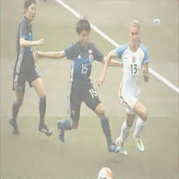

# 🧼 Image Denoising with U-Net

This project implements an image denoising model using a U-Net architecture trained on the DIV2K dataset. The model learns to remove noise from images using deep convolutional networks.

---

## 📁 Project Structure

```
DeepLearningProject/
├── scripts/
│   ├── train.py           # Trains the U-Net model on noisy images
│   └── run_denoiser.py    # Runs inference on a noisy image
├── models/
│   └── unet_denoiser.pth  # Trained model weights
├── data/
│   └── DIV2K/             # Folder for training and testing images (ignored by Git)
├── .gitignore
└── README.md
```

---

## ⚙️ Requirements

Install dependencies:

```bash
pip install torch torchvision matplotlib pillow pytorch-msssim
```

Tested with Python 3.10+.

---

## 📦 Dataset Setup

This project uses the [DIV2K dataset](https://data.vision.ee.ethz.ch/cvl/DIV2K/).

**Note:** The dataset is **not included** in the repo to avoid large file uploads.

After downloading DIV2K, organize it like this:

```
data/
└── DIV2K/
    ├── DIV2K_train_HR/
    └── DIV2K_train_LR/
```

Update the paths in your `train.py` and `run_denoiser.py` scripts if needed.

---

## 🚀 Usage

### 🔧 Train the Model
```bash
python scripts/train.py
```

This will train the model and save `unet_denoiser.pth` in the `models/` folder.

---

### 📤 Run Inference
```bash
python scripts/run_denoiser.py
```

This will process a noisy image and save `denoised_result.png`.

---

## 📈 Sample Result

| Noisy Input | Denoised Output |
|-------------|-----------------|
|  |  |

> You can add your own example outputs in the `examples/` folder and update this table.

---

## 🧾 License

This project is for educational use. Attribution appreciated if reused.

```
