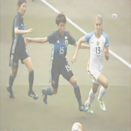

# Image Denoising with U-Net (Deep Learning)

This project implements an image denoising pipeline using a U-Net convolutional neural network. The model takes noisy RGB images and restores their clarity by learning a mapping from noisy inputs to clean outputs. Built with PyTorch and trained on custom noisy datasets.



---

## 🧠 Tech Stack

- **Language:** Python 3.10+
- **Libraries:** PyTorch, torchvision, PIL, matplotlib
- **Model:** U-Net (with skip connections and upsampling)
- **Utilities:** CUDA support, image transform pipelines

---

## 🚀 Features

- U-Net architecture with encoder-decoder and skip connections  
- Fully functional denoising pipeline with preprocessing and inference  
- Denoised output saved and visualized next to noisy input  
- Support for CPU and GPU (CUDA if available)

---

## 📦 Installation

```bash
# Clone the repository
git clone https://github.com/ALyS123/image-denoising-unet.git
cd image-denoising-unet

# Create virtual environment (optional but recommended)
python -m venv venv
source venv/bin/activate      # macOS/Linux
venv\Scripts\activate         # Windows

# Install dependencies
pip install torch torchvision matplotlib pillow
```

---

## 🖼️ Running the Model

Make sure your model and image files exist in the correct directories:
- Trained model path: `models/unet_denoiser.pth`
- Input image path: `data/0765.png` *(or any RGB image)*

```bash
python run_denoising.py
```

The script will:
- Load and preprocess the image
- Run inference with the U-Net model
- Save the denoised image as `denoised_result.png`
- Display both input and output side by side

---

## 📁 Project Structure

```text
image-denoising-unet/
├── models/                # Pretrained model (.pth)
├── data/                  # Input image(s)
├── run_denoising.py       # Inference pipeline
├── unet_model.py          # U-Net architecture
├── assets/                # Optional: store visuals here
├── README.md              # Project documentation
```

---

## 🔬 Example Result

| Noisy Input | Denoised Output |
|-------------|-----------------|
|  |  |  

---

## 🛠 Future Improvements

- Add training pipeline and dataset preparation scripts  
- Support for grayscale or medical image formats  
- Add metrics (PSNR, SSIM) for evaluation  
- Improve noise simulation and augmentation

---

## 📄 License

This project is licensed under the [MIT License](LICENSE).
